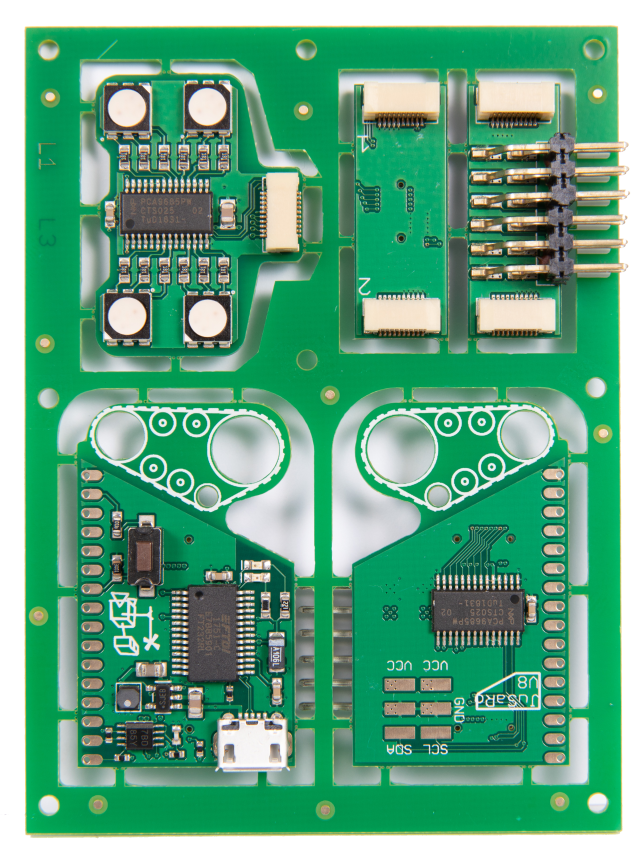
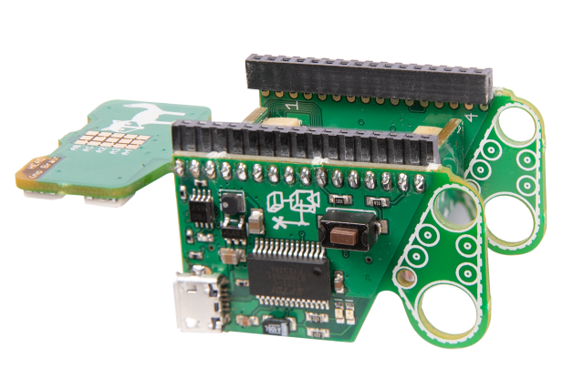

# Assembling

Usually your HuCon comes to you as a kit. The kit contains the following components:

1. Omega2+ from [Onion](https://onion.io/)
2. HuCon boards
3. pin header

!!! attention
     It may be that the pin header is too long. In this case it must be shortened to the correct length.
    {.normal_width}

The pin header should be soldered to the boards before they are removed from the panel.

Then you can cut the boards with a small side cutter at the marked places.

The extend of separation can be removed with a small file. This will let your roboter stand more secure later on. :smile:

Afterwards the robot can be assembled as shown in the following picture.

{.normal_width}

First the boards (except the head) are assembled. On the boards there are small numbers documenting the assembly. If you look at the robot from below and all the numbers fit together, then you have put the boards together correctly.

The Omega2+ is then plugged onto the pin headers. Make sure that the SD card slot is facing upwards. If you have assembled your HuCon correctly, it can stand on its own! Otherwise it will fall backwards.

Jetzt musst du nur noch den Kopf auf deinen HuCon stecken und er ist fertig.
